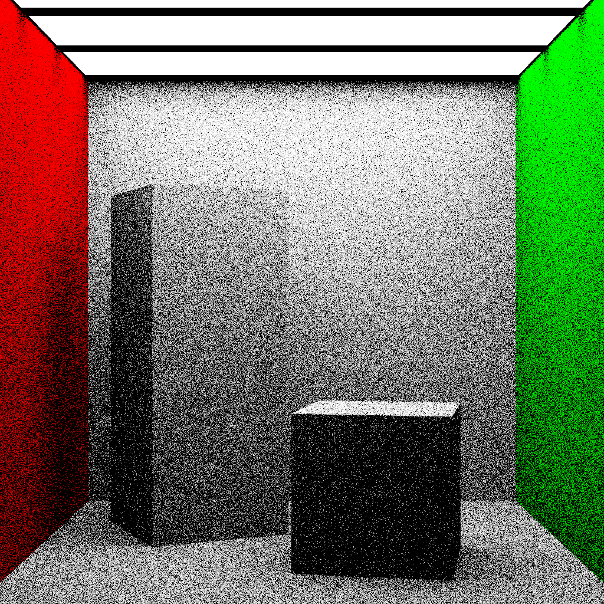
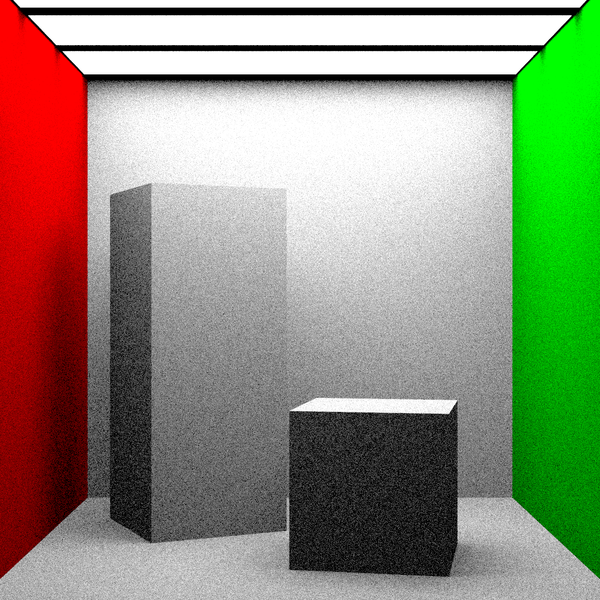

# Simple Renderer

## Times

### 10 spp

| Sampling Method        | small | med   | big   | many  |
| ---------------------- | ----- | ----- | ----- | ----- |
| Uniform Hemisphere (0) | 9.1s  | 9.3s  | 8.9s  | 9.6s  |
| Cosine Weighted (1)    | 9.2s  | 9.4s  | 9.2s  | 9.9s  |
| Light (2)              | 8.26s | 8.42s | 8.47s | 8.40s |

### 100 spp

| Sampling Method        | small | med   | big   | many  |
| ---------------------- | ----- | ----- | ----- | ----- |
| Uniform Hemisphere (0) | 90.8s | 91.2s | 91.7s | 97.9s |
| Cosine Weighted (1)    | 91.8s | 94.7s | 92.7s | 95.8s |
| Light (2)              | 80.8  | 82.1s | 82.2s | 82.4s |

### 1000 spp

| Sampling Method        | small | med  | big  | many |
| ---------------------- | ----- | ---- | ---- | ---- |
| Uniform Hemisphere (0) | 909s  | 858s | 855s | 882s |
| Cosine Weighted (1)    | 894s  | 893s | 884s | 912s |
| Light (2)              | 806s  | 820s | 827s | 828s |

## Questions

> Why can’t we render point and directional lights with uniform hemisphere sampling or cosine weighted sampling?

Uniform hemisphere sampling or cosine weighted sampling does not work in case of point and directional lights because they are delta distributions. In solving the integral, we use the dirac delta function, which evaluates to a non-zero value at exactly one point/direction. Thus, on sampling randomly, we have 0 probability of getting that exact same point/direction, making this method impractical. We can directly evaluate the formula as the dirac delta eliminates the integral, and then we simply substitute the value.

> Why does the noise increase for the same number of samples in the case of uniform hemisphere and cosine weighted sampling as the size of the area light decreases?

As the size of the area light decreases, the probability of sampling a direction towards the area light also decreases. Because of this, we get less data points that intersect with the area light. This leads to higher variance in the data, resulting in increased noise in the image. Light sampling works better in this case as points are sampled on the lights only, thus accurate results are observed.

## Images

### Small
#### Uniform Hemisphere Sampling

  
  
  

#### Cosine Weighted Sampling

  
  
  

#### Light Sampling

  
  
  

### Medium
#### Uniform Hemisphere Sampling

  
  
  

#### Cosine Weighted Sampling

  
  
  

#### Light Sampling

  
  
  

### Big
#### Uniform Hemisphere Sampling

  
  
  

#### Cosine Weighted Sampling

  
  
  

#### Light Sampling

  
  
  

### Many
#### Uniform Hemisphere Sampling

  
  
  

#### Cosine Weighted Sampling

  
  
  

#### Light Sampling

  
  
  

