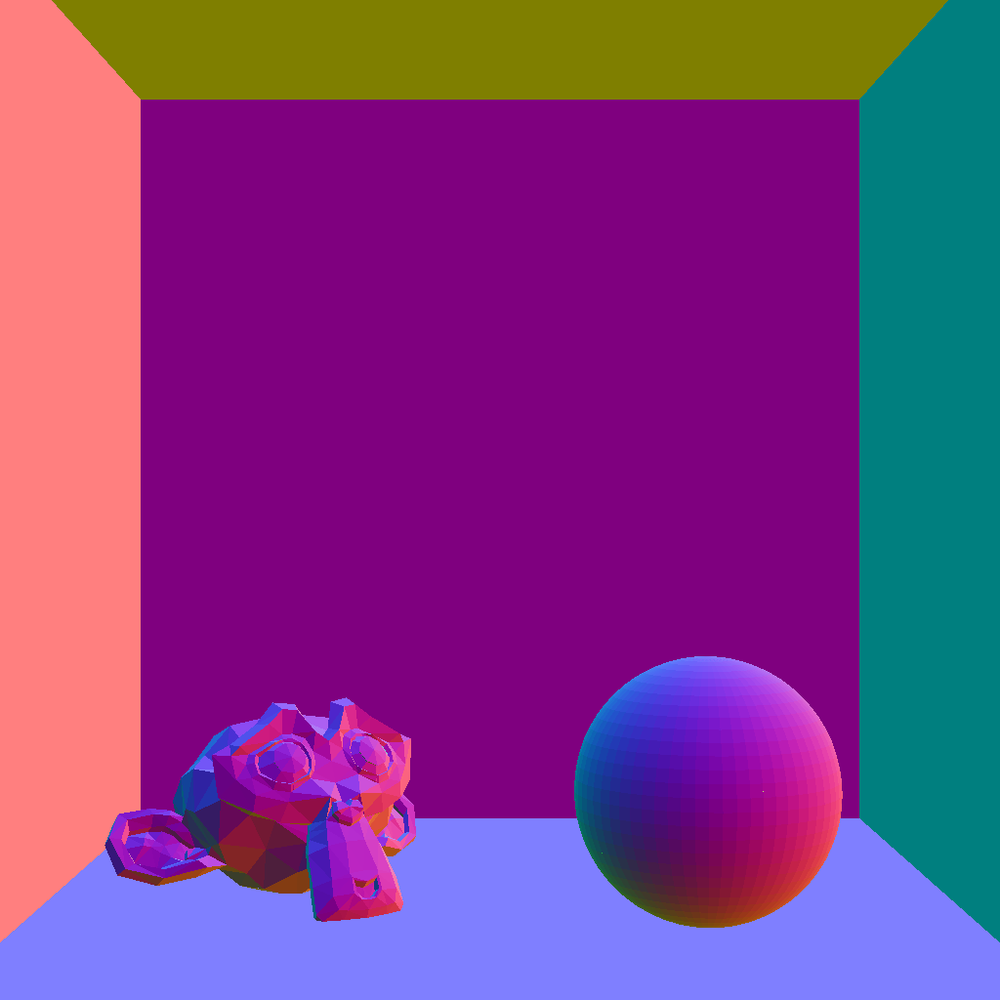
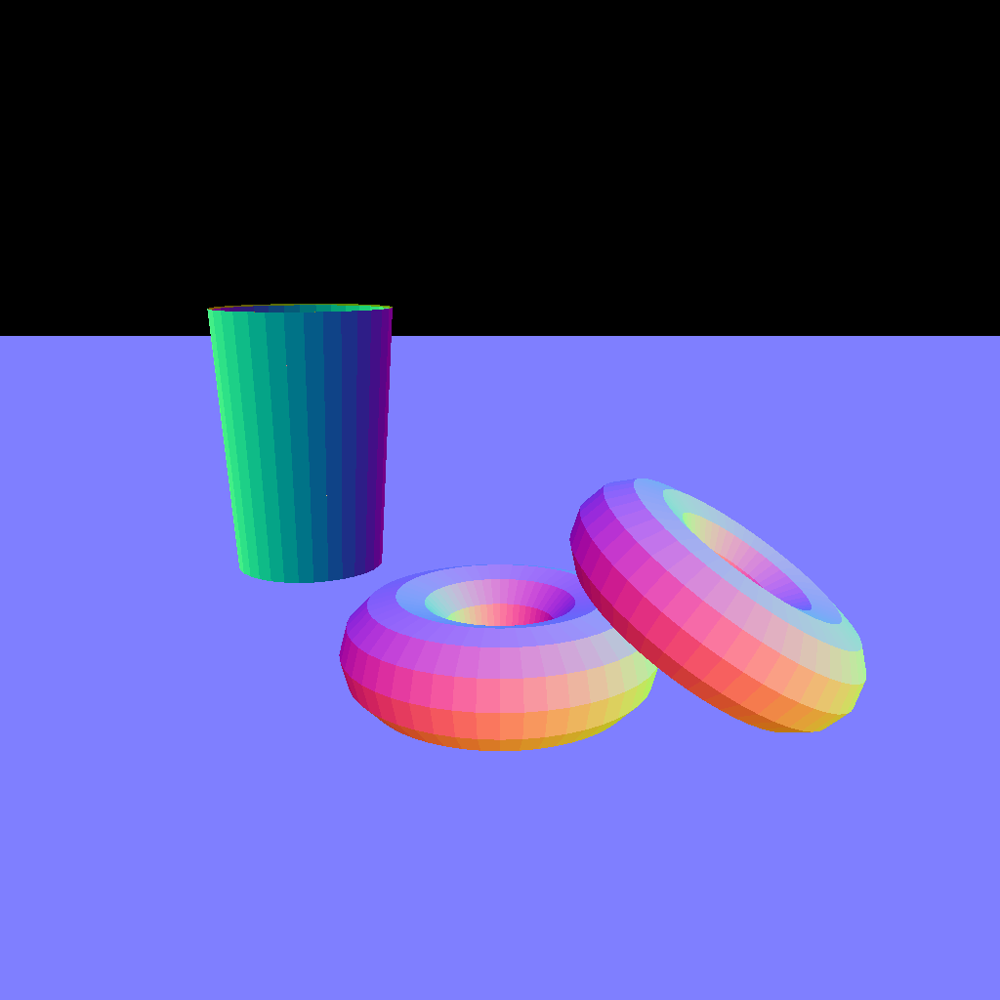
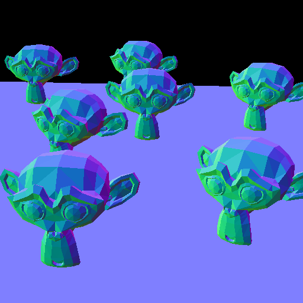

# Assignment 1: Bounding Volume Hierarchies

# Question 1

The discrepancy in the renderings is caused due to floating point precision. All the coordinates have been shifted by 1 million, but since the relative distance between the pixels is still very small, adding this distance to the large overall coordinates doesn't make a difference, thus losing the depth of the image.

This snippet demonstrates the loss in precision
```cpp
#include <iostream>

int main()
{
    float large{1e6};
    float small{0.1};

    float new_large{large + 0.01f};
    float new_small{small + 0.01f};
    std::cout << new_large - large << ' ' << new_small - small << std::endl;

    return 0;
}
```
> 0 0.01

We would expect the output to be `0.01 0.01`, but instead we get `0 0.01`.

The solution is to shift the origin of the entire scene to the camera. Through this, all the coordinates will be adjusted according to the camera, thus reducing their values to be small enough for high precision arithmetic.

Another approach would be to shift all the coordinates by the average of all the vertices of the scene. This minimizes the floating point magnitudes the most.

# Question 2
<div align="center">

| Intersection Variant | Cornell Low Poly | Cornell High Poly | Donuts | TableTop | 
| - | - | - | - | - |
| Naive (0) | 45462.83 | 189954.94 | 57542.81 | 51975.06 |
| AABB (1) | 1043.06 | 3653.11 | 1307.59 | 952.95 |
| BVH on AABB (2) | 1075.08 | 3721.50 | 1324.29 | 987.35 |
| BVH on Triangles (3) | 395.26 | 417.53 | 620.84 | 187.57 |

</div>

> Measured in ms

The times taken by (1) and (2) are almost identical. This is because these scenes contain only a handful of objects, thus constructing a BVH of just those objects does not influence the runtime much.

The rendered images are available in the [outputs](outputs) folder. All four intersection variants render exactly the same image.




