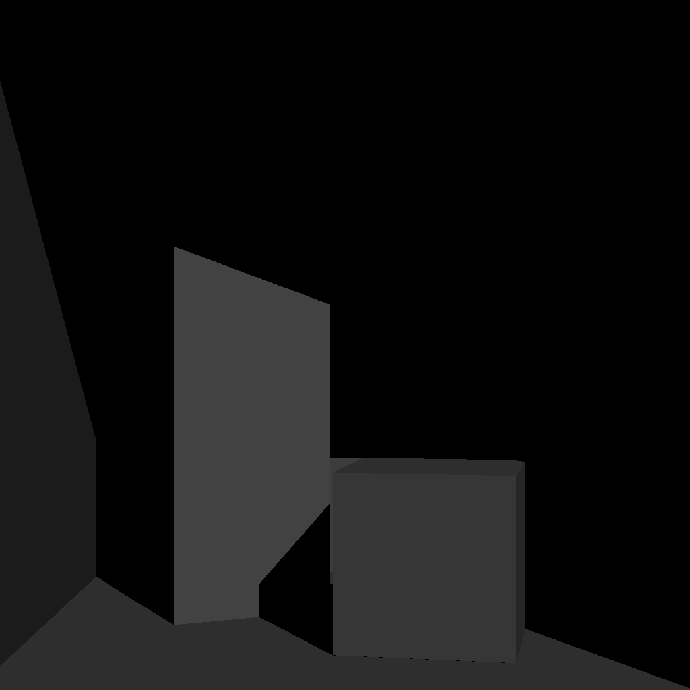
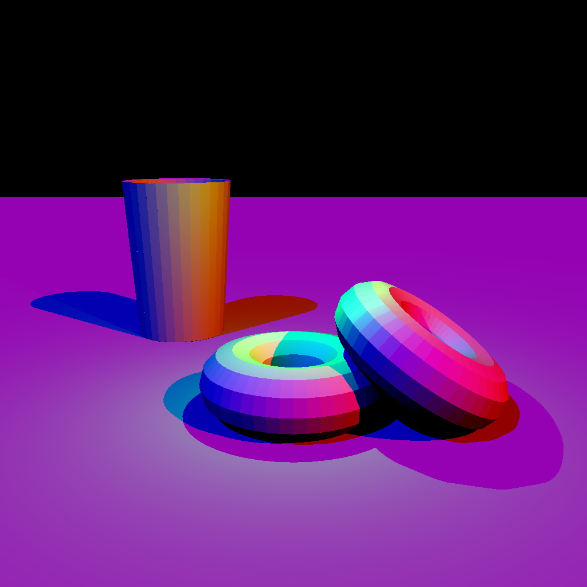
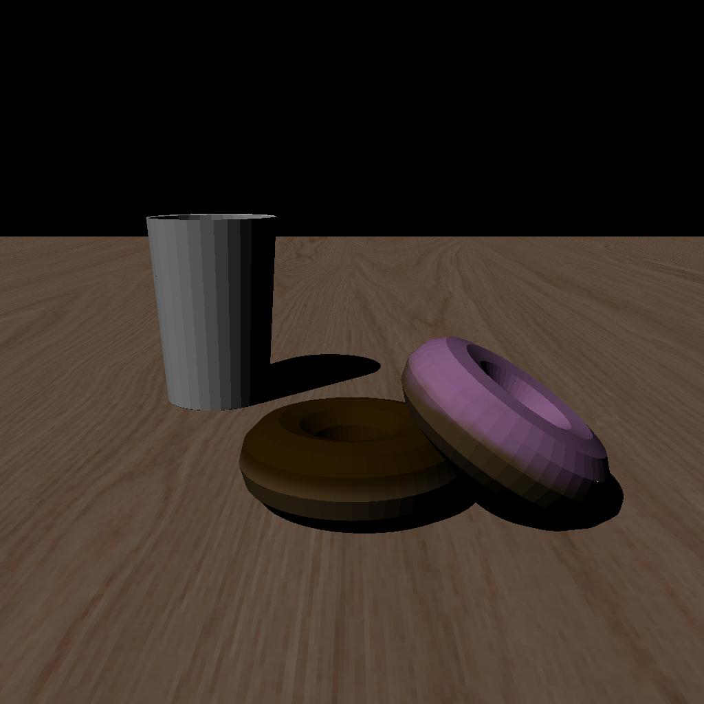
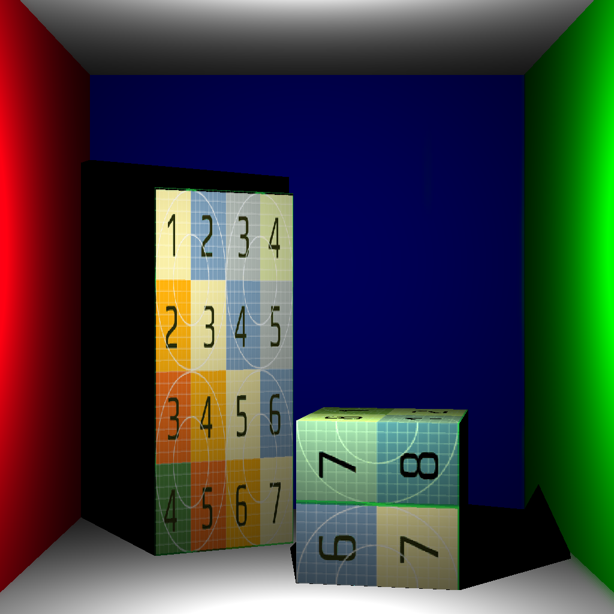
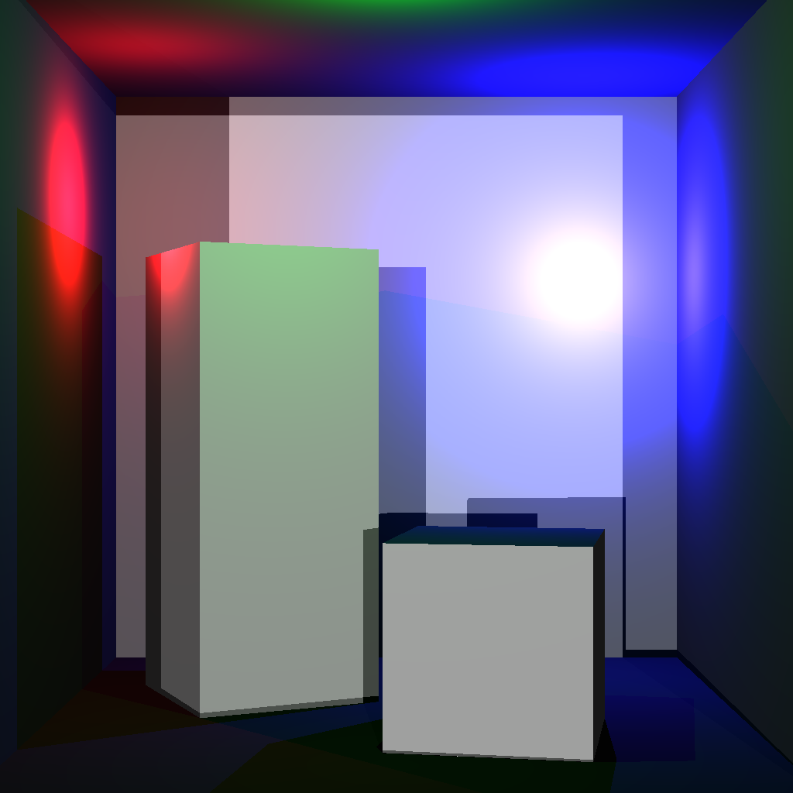
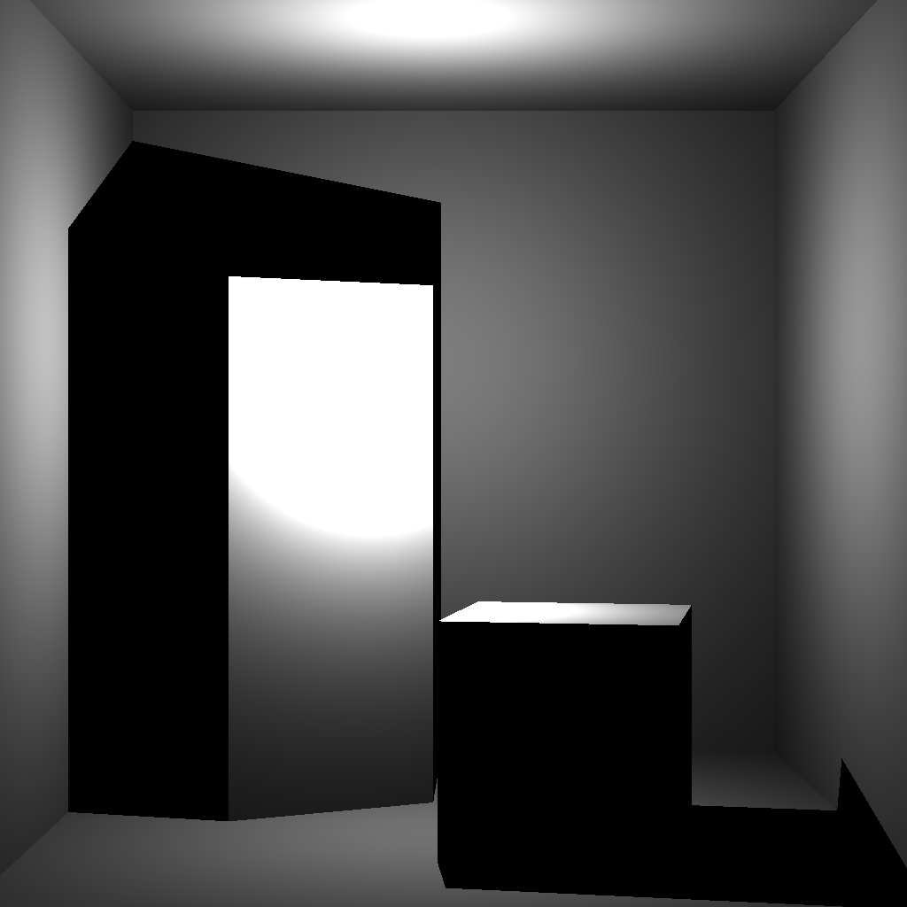
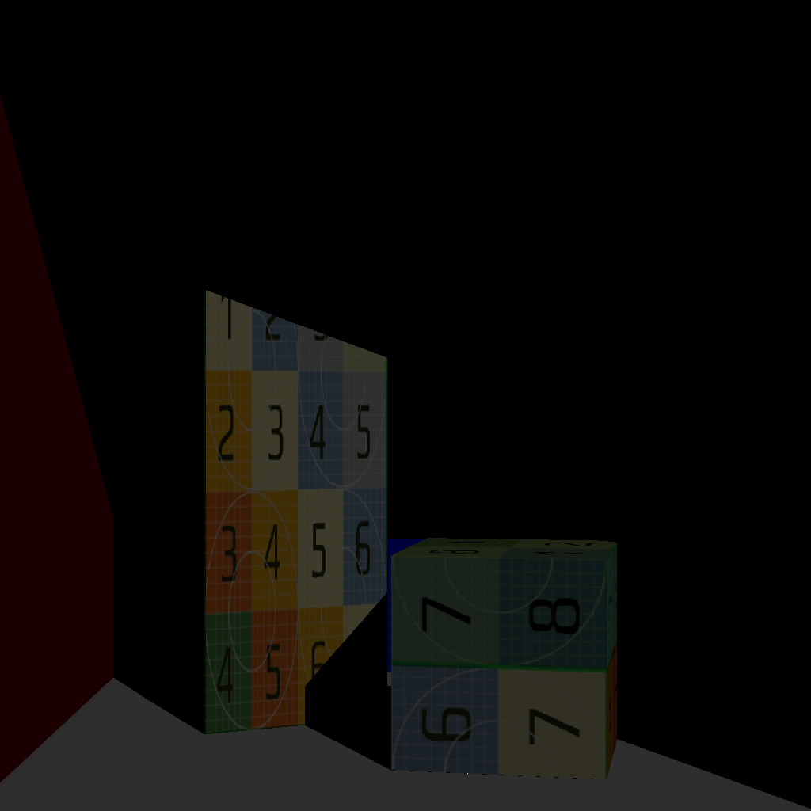
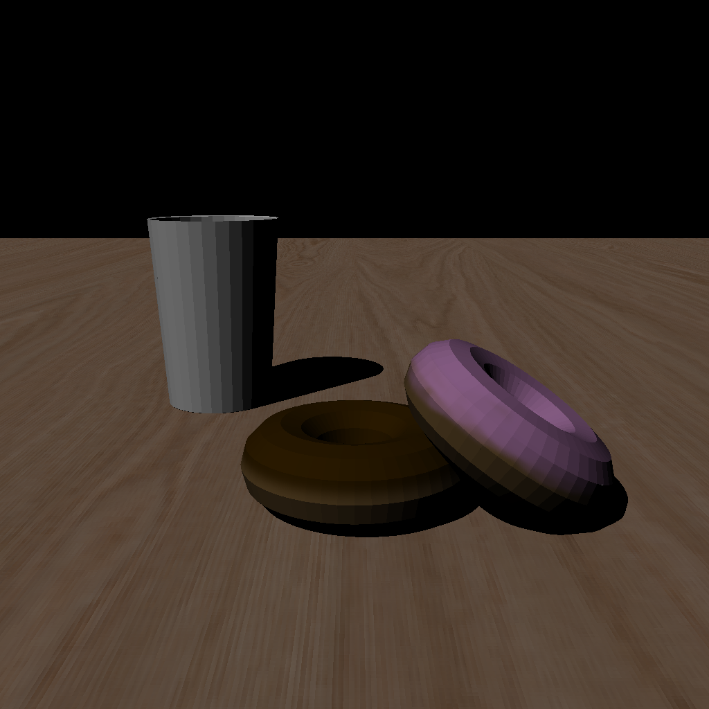
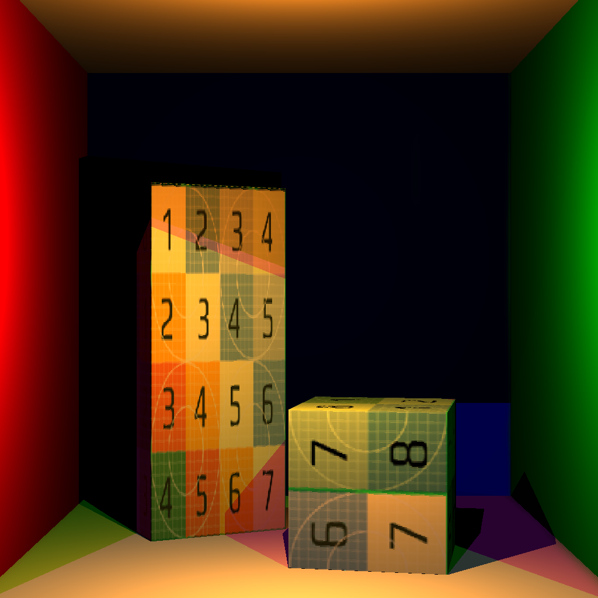

# Assignment 2: Lights and Textures

## Question 1

> Measured in ms

| Point Light | Directional Light | Many Lights | Donuts  |
| ----------- | ----------------- | ----------- | ------- |
| 766.68      | 686.70            | 2258.41     | 2201.27 |

## Question 2

> Measured in ms

| Interpolation Variant | Point Light | Directional Light | Many Lights | Donuts   |
| --------------------- | ----------- | ----------------- | ----------- | -------- |
| Nearest Neighbour (0) | 1113.33     | 1086.98           | 2123.5      | 20051.67 |
| Bilinear (1)          | 1121.30     | 1109.03           | 2156.21     | 19957.45 |

## Outputs

